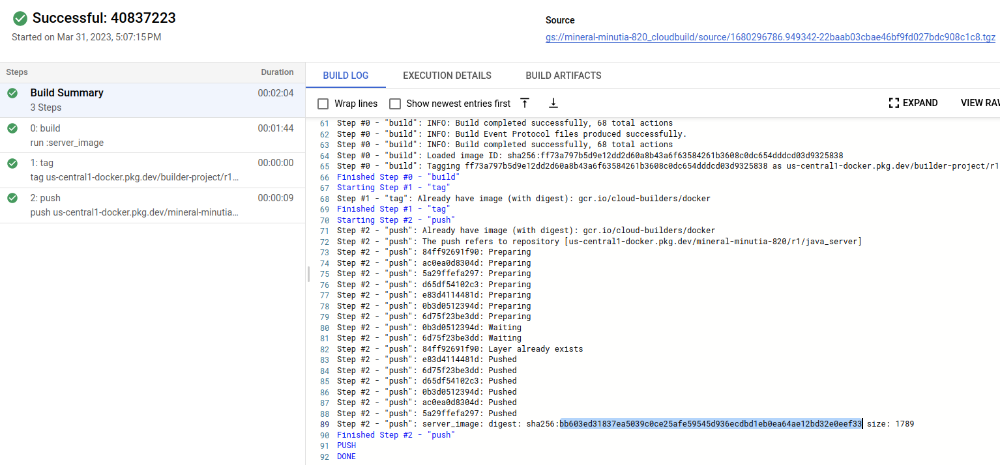

## Deterministic container images with java and GCP APIs using [bazel](https://bazel.build/)


The following sample will build a simple container that uses GCP KMS apis.  

These images are will have a consistent image hash no matter where it is built

*  `java_server@sha256:bb603ed31837ea5039c0ce25afe59545d936ecdbd1eb0ea64ae12bd32e0eef33`



For reference, see:

- [Building deterministic Docker images with Bazel](https://blog.bazel.build/2015/07/28/docker_build.html)
- [Create Container images with Bazel](https://dev.to/schoren/create-container-images-with-bazel-47am)
- [rules_docker](https://github.com/bazelbuild/rules_docker)
* [Deterministic builds with go + bazel + grpc + docker](https://github.com/salrashid123/go-grpc-bazel-docker)
* [Deterministic builds with nodejs + bazel + docker](https://github.com/salrashid123/nodejs-bazel-docker)
* [Deterministic container images with c++ and GCP APIs using bazel.](https://github.com/salrashid123/cpp-bazel-docker)
* [Deterministic container images with python and GCP APIs using bazel](https://github.com/salrashid123/python-bazel-docker)


To run this sample, you will need `bazel` installed (see [Cloud Shell](#cloud-shell) for an easy way to use `bazel`)

In the end, you'll end up with the same digests

```bash
export PROJECT_ID=`gcloud config get-value core/project`
export PROJECT_NUMBER=`gcloud projects describe $PROJECT_ID --format='value(projectNumber)'`
export GCLOUD_USER=`gcloud config get-value core/account`
```


```bash
$ bazel version
Build label: 6.1.1
Build target: bazel-out/k8-opt/bin/src/main/java/com/google/devtools/build/lib/bazel/BazelServer_deploy.jar
Build time: Wed Mar 15 15:44:56 2023 (1678895096)
Build timestamp: 1678895096
Build timestamp as int: 1678895096
```

```bash
export JAVA_HOME=/path/to/java/jdk-11
bazel run  :main 
bazel run  :server_image

# gcloud auth application-default login
# docker run -ti  \
#  -v $HOME/.config/gcloud:/root/.config/gcloud gcr.io/google.com/cloudsdktool/google-cloud-cli gcloud auth application-default print-access-token

docker run -t  \
  -v $HOME/.config/gcloud:/root/.config/gcloud \
  -e GOOGLE_CLOUD_PROJECT=$PROJECT_ID \
  us-central1-docker.pkg.dev/builder-project/r1/java_server:server_image
```


To deploy on cloud platform

```bash
gcloud artifacts repositories create r1 --repository-format=docker --location=us-central1 
gcloud artifacts repositories add-iam-policy-binding r1 \
    --location=us-central1  \
    --member=serviceAccount:$PROJECT_NUMBER@cloudbuild.gserviceaccount.com \
    --role=roles/artifactregistry.writer

gcloud beta builds submit .
```
